# C언어 순수 구현 기반의 이미지 프로세싱
## 구현범위
*  그레이스케일 .raw
*  정사각형의 이미지
*  처리방법
    * 화소점처리
    * 화소영역처리
    * 기하학적처리
## 구조도와 변수설정

## 실행화면
### 메뉴
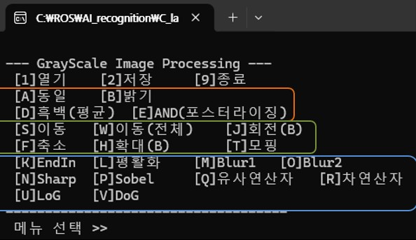
### 밝기조절
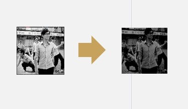
### 이진화
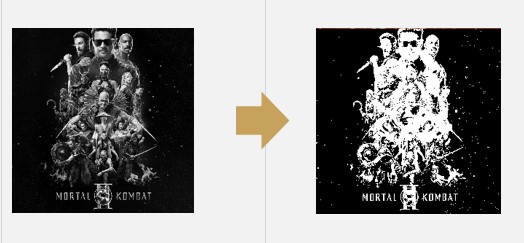
### 포스터라이징
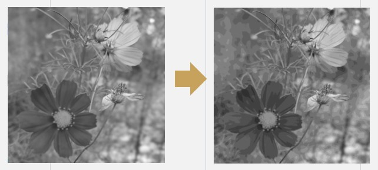
### 블러링
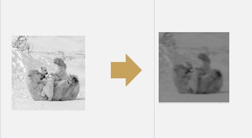
### 샤프닝
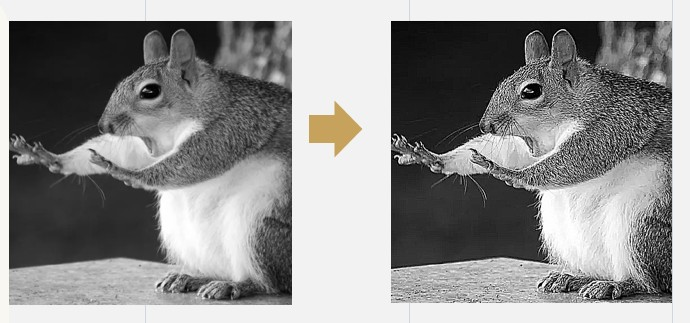
### 유사연산자
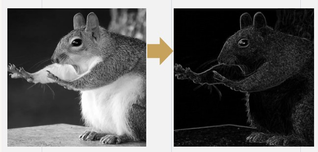
### 평활화
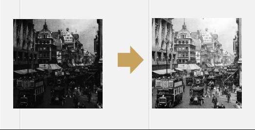
### 이동
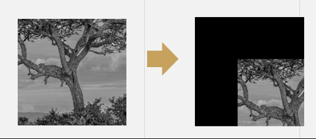
### 회전
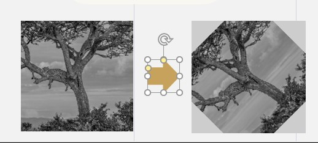
### 모핑
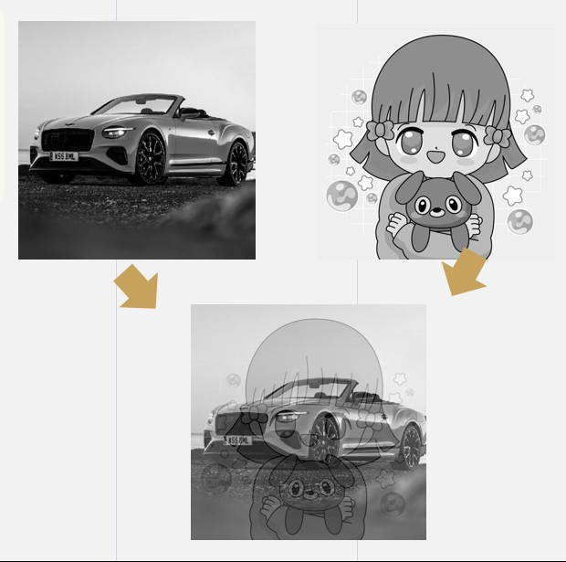

